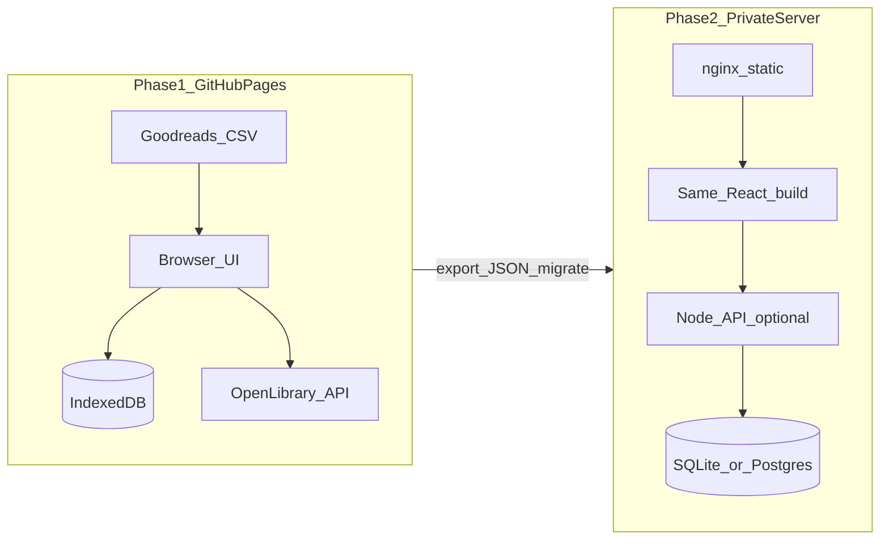

# Home Library: GitHub Pages → Private Server Plan

## What you want

A personal library app to track:

- Books you **own** (Kindle, paper, or both)
- Books you **want to read** (from Goodreads export)
- **Series suggestions** in reading order for series you have started

You will develop it with **Cursor agent** (this chat). There is **no repo yet**.

## Important constraints (shapes the architecture)

| Constraint | Implication |
|---|---|
| **GitHub Pages serves static files only** | No database or server API on Pages. Phase 1 stores data in the browser (IndexedDB) and supports JSON export/import for backup. |
| **Goodreads API is discontinued** | “Want to read” and ratings come from **CSV export**, not live sync. Re-import when your Goodreads list changes. |
| **Kindle has no public personal-library API** | Kindle books are tracked manually (or bulk-added later). Format field: `kindle` / `paper` / `both`. |
| **No reliable free “series reading order” API** | MVP uses a **hybrid**: Open Library metadata lookup + a local `series` table you can edit + heuristic ordering (publication year / series number when available). |

This is the standard pattern for “static first, server later”: build the frontend and data model now so adding a backend later is a swap, not a rewrite.

## Recommended stack

- **Frontend:** Vite + React + TypeScript
- **UI:** Simple responsive layout (search, filters, book cards, import screen)
- **Storage (Phase 1):** IndexedDB via a small abstraction (`StorageProvider`)
- **Deploy (Phase 1):** GitHub Actions → GitHub Pages (`https://<username>.github.io/home-library/`)
- **Deploy (Phase 2):** Same `dist/` build served by nginx on your private server; optional Node API + SQLite added behind it



## What I can do vs what needs you

### I can do (after you approve this plan)

1. Create project at `C:\Users\mateu\Projects\home-library` (or your preferred name)
2. Move Cursor workspace into that project (`move_agent_to_root`)
3. Scaffold app, data model, UI, Goodreads CSV parser, series suggestion logic
4. Add GitHub Actions workflow for Pages deploy
5. Initialize git and prepare everything to push

### You will need to do (one-time, ~10–15 min)

1. **Install and log in to GitHub CLI** (you have GitHub account but not `gh` yet):
   ```powershell
   winget install GitHub.cli
   gh auth login
   ```
2. **Export Goodreads library** (desktop only): My Books → Tools → Import and export → Export Library → download CSV
3. **Confirm repo visibility** when I create it (public repo is typical for free GitHub Pages on `github.io`)
4. **Later (private server):** provide SSH/host access, domain (optional), and preferred OS (Linux assumed)

I cannot fully publish to GitHub without your `gh auth login` step. Everything else I can automate.

---

## Implementation phases

### Phase A — Project bootstrap (Day 1)

**Actions:**

- Create repo folder and git init via `create_project`
- `move_agent_to_root` so all further work happens in the project workspace
- Scaffold Vite + React + TypeScript with `base: '/home-library/'` for GitHub Pages subpath
- Add README with local dev + deploy instructions

**Core data model:**

```ts
Book {
  id, title, authors[], isbn13?,
  formats: ('kindle'|'paper')[],
  status: 'owned' | 'want-to-read' | 'reading' | 'read',
  rating?, startedAt?, finishedAt?, notes?,
  seriesId?, seriesNumber?,
  source: 'manual' | 'goodreads'
}

Series {
  id, name, books: { bookId, order, title }[]
}
```

**Storage abstraction** (key for easy migration):

- `LocalStorageProvider` — IndexedDB implementation (Phase 1)
- `ApiStorageProvider` — stub for Phase 2 (same interface, HTTP calls)

---

### Phase B — MVP features (Day 1–2)

**1. Manual book management**

- Add / edit / delete books
- Filter by format, status, author
- Search by title/author/ISBN

**2. Goodreads CSV import**

- Upload `goodreads_library_export.csv`
- Parse known columns: Title, Author, ISBN13, My Rating, Date Read, Bookshelves, Exclusive Shelf, Private Notes
- Map shelves → app status (`to-read` → `want-to-read`, `read` → `read`, etc.)
- Merge strategy: match on ISBN13 when possible, else title+author; don’t duplicate owned books

**3. Series suggestions**

- When a book has (or is assigned) a series:
  - Look up metadata via [Open Library Search API](https://openlibrary.org/dev/docs/api/search) (title/author/ISBN)
  - Show “Next in series” based on local series order + books you already own/read
- Allow manual series linking when auto-detection fails (common for obscure series)

**4. Backup / portability**

- Export library to JSON (for backup and future server migration)
- Import JSON (restore or move to private server)

---

### Phase C — GitHub repository and Pages (after `gh auth login`)

**Actions:**

1. `gh repo create home-library --public --source=. --remote=origin`
2. Push `main` branch
3. Add [`.github/workflows/deploy-pages.yml`](.github/workflows/deploy-pages.yml):
   - Trigger on push to `main`
   - `npm ci && npm run build`
   - Deploy `dist/` to GitHub Pages via `actions/deploy-pages`
4. Enable Pages: Settings → Pages → Source = GitHub Actions (you click once; I’ll tell you exactly when)

**Result:** live site at `https://<your-username>.github.io/home-library/`

---

### Phase D — Private server migration (later, when you’re ready)

No rewrite needed if we follow the storage abstraction from day one.

**Typical migration path:**

1. Add lightweight backend (Node + Express/Fastify + SQLite) on your server
2. Implement `ApiStorageProvider` pointing to your server API
3. Build frontend with `VITE_API_URL=https://library.yourdomain.local`
4. Serve `dist/` with nginx; proxy `/api` to Node
5. One-time import: upload JSON export from Phase 1
6. Optional: Docker Compose (`nginx` + `api` + volume for DB)

**What changes on private server vs Pages:**

| Concern | GitHub Pages | Private server |
|---|---|---|
| Data persistence | Browser IndexedDB (per device) | Central DB (all devices) |
| Auth | None (personal URL) | Optional basic auth or login |
| Goodreads | CSV re-import | Same CSV + optional scheduled import |
| HTTPS | GitHub provides | Let’s Encrypt on your server |

---

## Suggested project structure

```
home-library/
├── src/
│   ├── components/       # BookCard, ImportDialog, SeriesPanel
│   ├── lib/
│   │   ├── storage/      # StorageProvider + IndexedDB impl
│   │   ├── goodreads/    # CSV parser + mapper
│   │   └── series/       # Open Library lookup + next-book logic
│   ├── types/            # Book, Series
│   └── App.tsx
├── .github/workflows/deploy-pages.yml
├── vite.config.ts        # base: '/home-library/'
└── README.md
```

---

## Development workflow with Cursor agent

After bootstrap:

1. You open the project workspace in Cursor (I’ll move the agent there)
2. You describe features or paste your Goodreads CSV for testing
3. I implement in small iterations; you verify in `npm run dev`
4. Each push to `main` auto-deploys to GitHub Pages

---

## Risks and honest limits

- **Series order quality** will be imperfect without a paid dataset; manual curation remains important for niche series.
- **GitHub Pages data is per-browser** until Phase 2; use JSON export as backup.
- **Kindle sync** is not automatable without unofficial tools; manual entry is the reliable MVP path.
- **Repo name** affects URL path; default `home-library` — tell me if you want a different name before I create it.

---

## Execution order (summary)

1. Create project + scaffold (me)
2. Build MVP: books, Goodreads import, series panel, export (me)
3. You: `gh auth login` + export Goodreads CSV
4. Create GitHub repo, push, enable Pages Actions (me, with your auth)
5. You test live site and import real data
6. Later: private server backend + migration (me + your server access)
